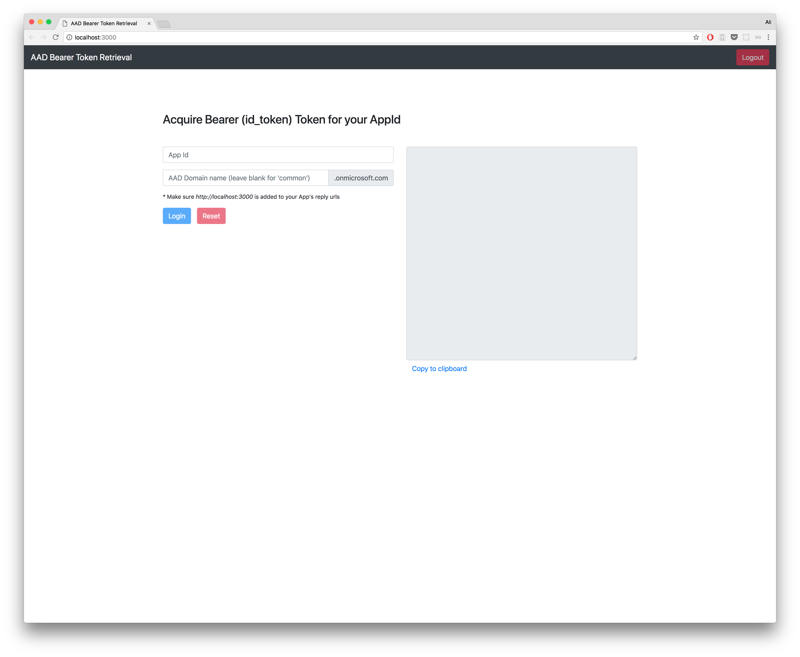
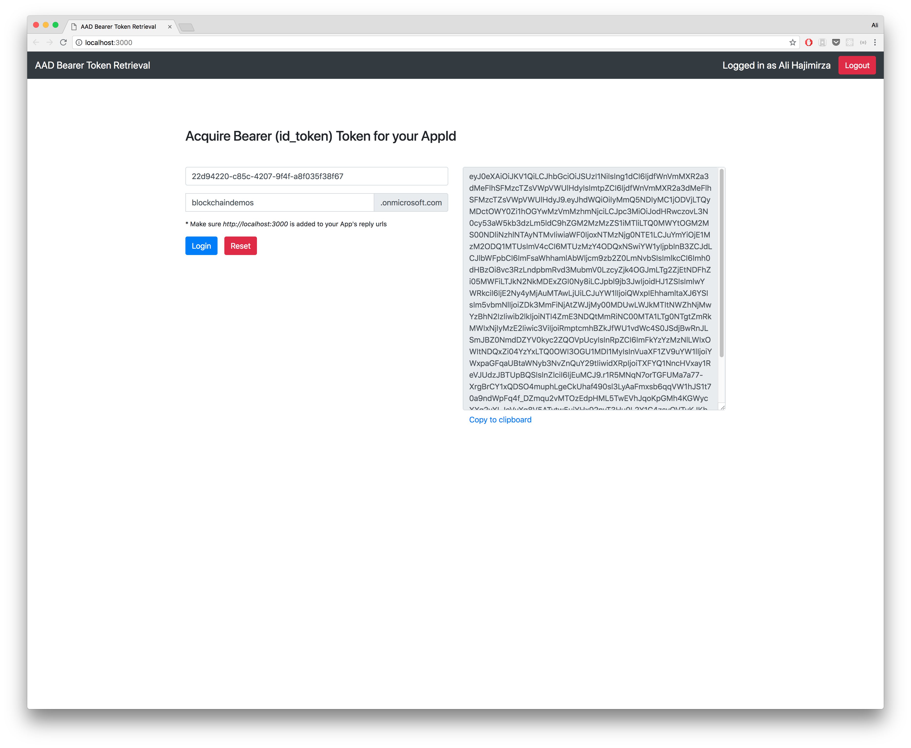

# ~~AAD Bearer Token Retrieval~~ (Deprecated)

> This tool is deprecated in favor of using postman to obtain the token [postman instructions ](../postman-user) and will be removed in the future.

## Overview
This is a simple tool that allows you to obtain a bearer token for your Workbench instance to be used for development purposes or through Postman.

> Note: This token is short lived and **should not** be hard-coded in source code.


## Prerequisite
* [NodeJS](https://nodejs.org/)
* http-server NodeJS package
* [Docker (Optional)](https://www.docker.com/products/docker-engine)
* Azure Active Directory App Registration (You will need the App Id)
* Please add `http://localhost:3000` to the reply urls of your AAD app

## Execution Instructions
You can run the Node application directly on your machine or via Docker. 

### Option 1 (Local Machine)

If not already installed, install http-server:

```
npm install http-server
```

Navigate to this directory and run the following commands:

```bash
npm install
npm start
```
This should open the following browser tab on [http://localhost:3000](http://localhost:3000)

### Option 2 (Docker)

Navigate to this directory and run the following commands:

### Build 

```bash
docker build -t awb-authsample:1.0 .
```
### Run 

```bash
docker run -d -p 3000:3000 awb-authsample:1.0
```

Open the browser and navigate to the URL: [http://localhost:3000](http://localhost:3000)




Type in your AAD AppId and the AAD domain name that you wold like to use. Leave the domain name blank if you want to use your native tenant (`common`)


Upon logging in you will see the bearer token generated for your AppId (The audience of this token is your appId)



> Note: This application will remember the input values in the browsers `localStorage` for your convenience. You can clear them by pressing the `Reset` button.
