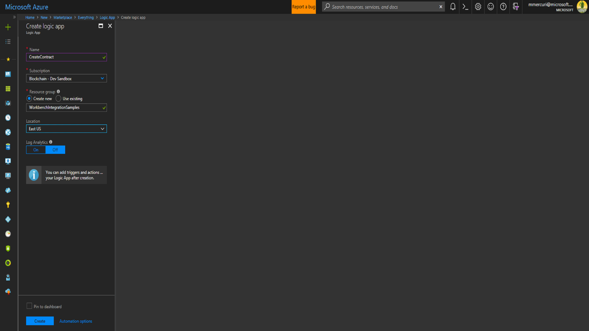
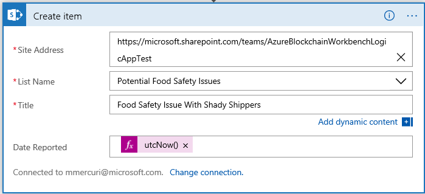
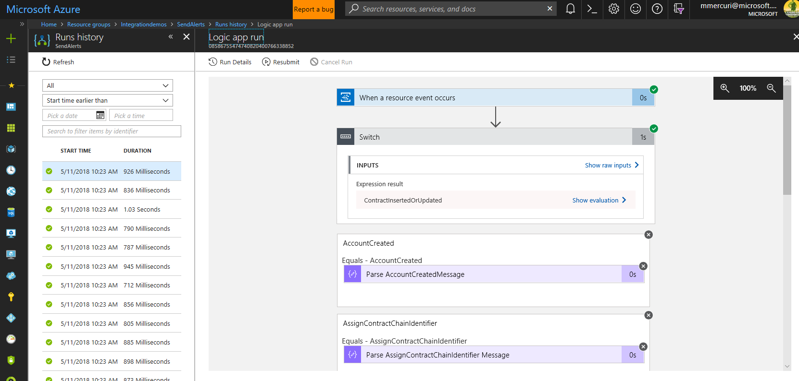

Trigger Sharepoint Action Based on Contract State After a Specific Contract Action
=================================================================================

Overview
--------

This logic app performs the following analysis on an incoming message, evaluates
the state of the contract and allows you to take appropriate action.

Specifically –
    
-   It identifies if the message is of type ContractFunctionInvocation.

-   If true, it identifies if the contract function invoked was named "IngestTelemetry".

-   If true, it will look up the contract using the ContractLedgerIdentifier.

-   Once found, it evaluates the value of the current contract state.

Of Note
-------

This sample is designed to work with the [RefrigeratedTransportation
application](https://github.com/Azure-Samples/blockchain/tree/master/blockchain-workbench/application-and-smart-contract-samples/refrigerated-transportation)
but can be easily adapted to other contracts by making changes to the name of
the action (“IngestTelemetry”) or the logic related to identifying the states.

Other samples will further extend this to send alerts via Outlook, SMS (Twilio)
and voice (Twilio).

Pre-Requisites
--------------

This sample takes a dependency on Sharepoint Online.

The pre-requisites for this sample include -

-   A SharePoint team site

-   A list on the team site named “Potential Food Safety Issues” that has two
    fields, Title and Date Reported.
    

Running a Stored Procedure
--------------------
Navigate to the database for your Azure Blockchain Workbench deployment.

Select the query editor.

Click Login and provide your database credentials. The username will be ‘dbadmin’ and the password is the one your provided during the installation of Azure Blockchain Workbench.

Click New Query and paste the following: 


CREATE PROCEDURE [dbo].[LogicAppGetContractStateFromContractLedgerIdentifier]
(
@ContractLedgerIdentifier NVARCHAR(256),
)
AS
BEGIN

Select Top 1 vw.StateValue from [vwContractState] vw
Where vw.ContractLedgerIdentifier = @ContractLedgerIdentifier

END

Go

Click the run button to create the stored procedures in the database.


Create the Logic App
--------------------

Navigate to the Azure Portal at <http://portal.azure.com>

Click the + symbol in the upper left corner of the screen to add a new resource.

Search for and select Logic App and then click Create.


Name the logic app “ExecuteBasedOnStateAfterSpecificAction”.

Specify the same resource group as your Azure Blockchain Workbench deployment.

Click the Create button.



A logic app is initiated by a trigger.

In this scenario, the trigger will be an event from Azure Blockchain Workbench
delivered via the Event Grid.

Within the Logic App Designer select the trigger “When an Event Grid event
occurs”.


Within the Logic App Designer, click the Sign In button for the action that was
just added.


Select the Azure Active Directory Tenant that the Azure Blockchain Workbench was
deployed to in the drop-down list and either sign in using your credentials or
connect using a Service Principal.

For this basic sample, you will sign in using your credentials.

Clicking Sign In will display a login dialog.


Once connected successfully, the trigger will show a check mark in a green
circle as demonstrated below.


Click the Continue button.

Next select the subscription for the Azure Blockchain Workbench, specify a
Resource Type of “Microsoft.EventGrid.Topics” and the resource name for the
Event Grid topic in the resource group for the Azure Blockchain Workbench
deployment.


Click the “+ New Step” button.

Select Initialize Variable. 

Put "ContractState" for Name, and the Type as String. Leave the value empty. 


Click the “+ New Step” button.

Click More and click the Add a Switch Case

For the Switch, there is an “On” field that identifies what value will be
evaluated.

Click the text box and then select “Subject” which contains the name of the
message type being delivered.

In the Case message on the right, enter the value of ContractFunctionInvocation.

Click the “…” in the upper right of the case and select Rename.

Rename the case to ContractFunctionInvocation.

Add the action “Data Operations – Parse Json” to the case.

In the Content field select Body.

In the Schema field, enter the following –
```
{
    "properties": {
        "additionalInformation": {
            "properties": {},
            "type": "object"
        },
        "caller": {
            "properties": {
                "id": {
                    "type": "integer"
                },
                "ledgerIdentifier": {
                    "type": "string"
                },
                "type": {
                    "type": "string"
                }
            },
            "type": "object"
        },
        "connectionId": {
            "type": "integer"
        },
        "contractId": {
            "type": "integer"
        },
        "contractLedgerIdentifier": {
            "type": "string"
        },
        "eventName": {
            "type": "string"
        },
        "functionName": {
            "type": "string"
        },
        "inTransactionSequenceNumber": {
            "type": "integer"
        },
        "messageName": {
            "type": "string"
        },
        "messageSchemaVersion": {
            "type": "string"
        },
        "parameters": {
            "items": {
                "properties": {
                    "name": {
                        "type": "string"
                    },
                    "value": {
                        "type": "string"
                    }
                },
                "required": [
                    "name",
                    "value"
                ],
                "type": "object"
            },
            "type": "array"
        },
        "transaction": {
            "properties": {
                "from": {
                    "type": "string"
                },
                "to": {
                    "type": "string"
                },
                "transactionHash": {
                    "type": "string"
                },
                "transactionId": {
                    "type": "integer"
                }
            },
            "type": "object"
        }
    },
    "type": "object"
}
```


Click the “More” link and then select “add a condition”.

Click in the box at the left of the condition. It will display the Dynamic
Content window, select “functionName” from the Dynamic Content list.

Set the condition to “is equal to”.

Set the condition value to IngestTelemetry.

This identifies that the contract function called was IngestTelemetry.

Add an action in the "if true" section so you can execute a stored procedure to find whether or not the contract is in the out of compliance state after the reading was taken. 

Select the procedure from earlier named "[dbo].[LogicAppGetContractStateFromContractLedgerIdentifier]"

Select the dynamic content "contractLedgerIdentifier" for the ContractLedgerIdentifier field. 


Add another action to set the variable which was initialized at the beginning of the logic apps flow. 

Set Name to ContractState and the value as the StateName from the SQL Stored Procedure. 


Add another Condition to check if the ContractState is equal to "OutofCompliance". 


You can now add logic that takes action based on the state after a specific
action. In this sample, if after a device provides telemetry that it is now in
an out of compliance state there may be a desire to send an alert.

In the case for the “In the OutofCompliance state”, click “Add an action”

Select SharePoint – Create Item

Click Sign in to create a connection to Sharepoint


This will display a login dialog for Office 365

Populate the site address and list name to add the item to.

Populate the title for the list item and use utcNow() to capture the current
time to include in the SharePoint list.

Note – You can use Dynamic Content in any of these values, allowing for dynamic
alerts specific to the context of any contract.



Save your Logic App

Testing
-------

You can test this functionality by taking the following steps –

1.  Navigate to the overview page of for the logic app in the portal and confirm
    that it is enabled (if it is not, click on the “disabled” link at the top of
    the screen to transition the logic app to an enabled state).

2.  Deploy the RefrigeratedTransportation sample application in Azure Blockchain
    Workbench.

3.  Add members to the new application for the roles of Owner, Counterparty,
    Device, and Observer.

4.  Create a new contract instance. Specify values of 1 and 15 for both the
    minimum and maximum values for temperature and humidity.

5.  Transfer responsibility to a party in the Counterparty role.

6.  Log out of Workbench and log in as the account associated with the Device

7.  Navigate to the contract you just created within Workbench.

8.  Take the action of “IngestTelemetry” and enter values of 50 for both
    temperature and humidity.

9.  The logic app should now be triggered and the code will be executed.

>   Navigate to the list in SharePoint to confirm it has been successfully
>   added.

>   If you’d like to look at the execution of the logic app to send the alert,
>   navigate to the logic app in the portal. At the bottom of the screen you
>   will detail for Runs history


1.  Click on the most recent execution of your logic app in the list.  
    This will show details on the trigger and actions executing within the logic
    app and allow you to validate success or troubleshoot reasons for failure.



1.  Once making changes in your logic app, you can navigate back to this same
    screen and click “Resubmit” and it will call the current version of your
    logic app with the values provided by the previous run.

### In Review

In many workflows, there is a need to execute logic based on a state change that
may occur after a specific action is taken on a smart contract.

The logic app created in this sample facilitates this need by –

-   Identifying if the message is of type ContractFunctionInvocation

-   If true, it identifies if the action executed was named “IngestTelemetry”

-   If that is true, it will run the stored procedure to find the contract using the contractLedgerIdentifier

-   Once found, it evaluates the value of the current state of the contract so that the
    appropriate logic can be executed.

