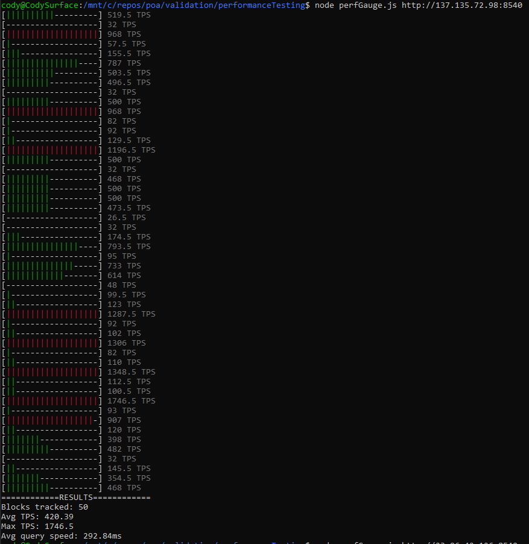
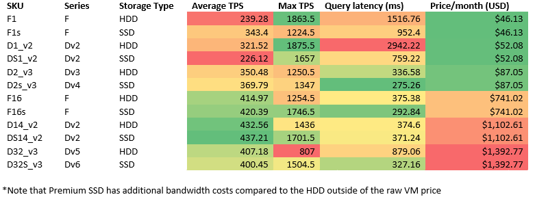

Proof-of-Authority Performance Benchmark Tool
=================
This is a useful tool for benchmarking the impact of network changes on performance.  This tool is only used for relative benchmarking.  Real-world performance will vary depending on many factors:
- Transaction size and type
- Node geo-location
- Transaction load balancing
- Node size
  - Memory
  - CPU
  - Disk type
  - Network I/O

#### mockTransactions.js
This tool will deploy a simple contract and perform state update transactions.  These transactions are submitted in batches.  Batch size is configurable.  The transaction submitter will wait one second between batch submissions.

#### perfGauge.js
This tool will listen for blocks and calculate the transactions per second as blocks are created.  Current TPS will be displayed in the console using `clui`.  Some transactions are sampled from each block to ensure they are successful.  Once 50 blocks have been seen, the aggregate results are printed out and the program terminates.

#### Usage
`sudo npm install`

node mockTransactions.js [RPC_ENDPOINT] [REQUESTS_PER_BATCH]

node perfGauge.js [RPC_ENDPOINT]

#### Hardware Benchmarking Results
##### Methodology
- Performance Runner Machine
  - Ubuntu 18.04
  - Standard D8s v3 (8 vcpus, 32 GB memory)
- 1000 transaction batches, 100 ms between batches
- 50 block sample
- Sampled .1% of transactions to ensure success
- Deployment Topology
  - 2 VMs West US, 2 VMs in East US
- Transactions were submitted to the West US instance from a West US machine
- Query latency was measured from the East US instance via my dev machine

##### Results

